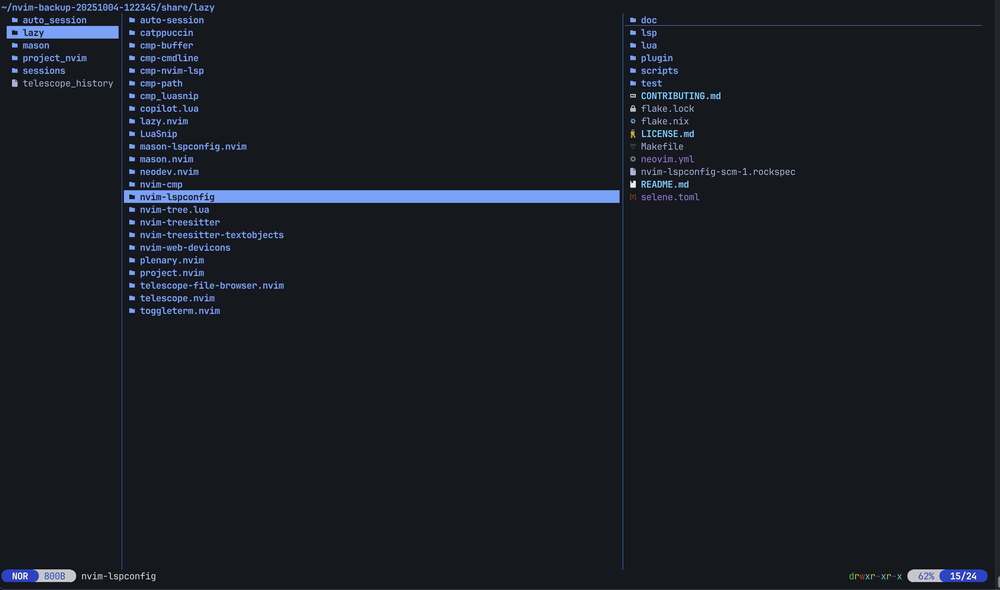

# Neon

A dark theme for [Yazi](https://github.com/sxyazi/yazi) with high-contrast colors. Based on the Tokyo Night palette.

## Preview



## Features

- High contrast selection and hover states
- Distinct colors for 100+ file extensions
- Dimmed dotfiles with italic styling
- Special treatment for system directories (.git, node_modules, build folders)
- Optimized for programming language files
- Finder-style date formatting

## Colors

The theme uses these accent colors:

-  `#7aa2f7` - Directories, TypeScript, C/C++
-  `#ff9e64` - Rust, Swift, audio files
-  `#e0af68` - JavaScript, JSON
-  `#9ece6a` - Executables, tests, databases
-  `#bb9af7` - Images, Kotlin, SCSS
-  `#f7768e` - Videos, HTML, Java, archives
-  `#7dcfff` - Go, Markdown

## Installation

### Using ya (Recommended)

```bash
ya pkg add tomer-ben-david/neon
```

### Manual Installation

Clone this repository:
```bash
git clone https://github.com/tomer-ben-david/neon.yazi.git ~/.config/yazi/flavors/neon.yazi
```

Set the flavor in your `~/.config/yazi/theme.toml`:
```toml
[flavor]
dark = "neon"
```

## Configuration

### Date Display
Enable Finder-style date formatting in your `~/.config/yazi/yazi.toml`:

```toml
[mgr]
linemode = "mtime"
```

This shows:
- Today: time only (`14:30`)
- Last 6 months: date and time (`Nov 17 14:30`)
- Older: date and year (`Jan 15  2024`)

### File Type Colors

System directories:
- `.git/` - red, bold
- `node_modules/`, caches - dimmed
- `dist/`, `build/`, `target/` - yellow

Common directories:
- `Downloads/` - blue
- `Documents/` - cyan
- `Pictures/` - teal
- `Music/` - orange
- `Videos/` - pink

## Credits

- Created by [Tomer Ben David](https://github.com/tomer-ben-david)
- Inspired by the Tokyo Night color scheme
- tmTheme by Himanshu (MIT License)

## License

MIT License - See [LICENSE](LICENSE) for details

The included tmTheme file is also MIT licensed - See [LICENSE-tmtheme](LICENSE-tmtheme)
